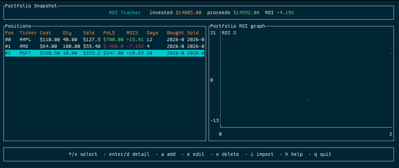

# RustROI

Terminal-first ROI tracker for active traders. Fast, local, keyboard-driven, and happy to live in a tmux pane.



[](https://crates.io/crates/rustroi)
[](https://docs.rs/rustroi)
[](https://crates.io/crates/rustroi)
[](LICENSE)
[](https://www.rust-lang.org)

## Highlights

- Offline, file-based: no accounts, no trackers.
- CSV import tailored to common brokerage exports (group headers + indented sell lots).
- Per-position ROI%, PnL$, days held; portfolio snapshot banner.
- Detail view with ROI timeline; portfolio scatter chart.
- Persistent storage in `positions.json` (auto-saved on add/edit/delete/import).
- Works great over SSH/WSL; pure terminal (crossterm + ratatui).

## Quickstart

```bash
cargo install roi
```

OR

```bash
git clone <this-repo>
cd roi
cargo run
```

### Controls

| Key            | Action                                  |
|----------------|-----------------------------------------|
| ↑ / ↓          | Move selection                          |
| Enter or d     | Position detail view                    |
| a              | Add position                            |
| e              | Edit selected position                  |
| x or Delete    | Delete selected position                |
| i              | Import from CSV                         |
| h              | Help                                    |
| q              | Quit                                    |

### CSV import

- Open the import dialog with `i` and provide a path to your CSV.
- Supported header patterns (auto-detected): `Symbol, Quantity, Date, Cost/Share $, Total Cost $, Date, Price/Share $, Proceeds $, Gain $, Deferred Loss $, Term, Lot Selection`.
- Grouped exports with a symbol summary row followed by indented `Sell` rows are handled; child rows inherit the last seen ticker.
- Dates: `YYYY-MM-DD` or `MM/DD/YYYY`.
- Numbers may include `$`, commas, or `--` (treated as missing).

Example minimal header (also accepted):

```text
ticker,cost,qty,sale,purchase_date,sale_date
GM,84.77,10,86.61,2026-01-27,2026-01-27
```

### Persistence

- All positions are stored in `positions.json` at the repo root.
- The file is written automatically on add/edit/delete/import.
- Delete `positions.json` to reset to seed sample data.

## Build

Requires Rust 1.75+.

```bash
cargo build --release
```

Binary will be at `target/release/roi`.

## Data shown

- **PnL$**: proceeds – cost basis.
- **ROI%**: PnL / cost basis.
- **Days held**: sale date – purchase date (min 1).

## Troubleshooting

- Import says “No rows found”: ensure the CSV contains the “TAXABLE G&L DETAILS” header or the 6-column minimal format.
- Ticker shows as previous symbol: child rows inherit the last non-`Sell` symbol; make sure summaries precede their lots.
- Bad date format: use `YYYY-MM-DD` or `MM/DD/YYYY`.

## License

MIT
